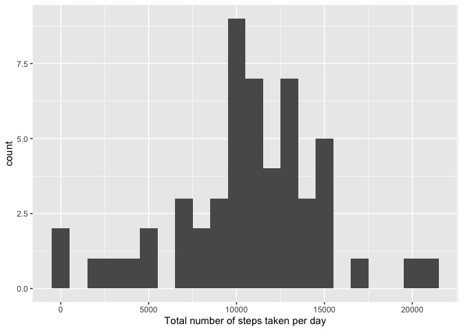
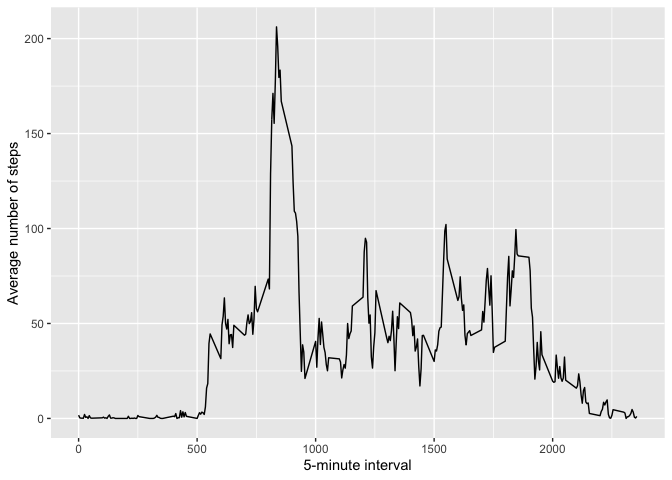
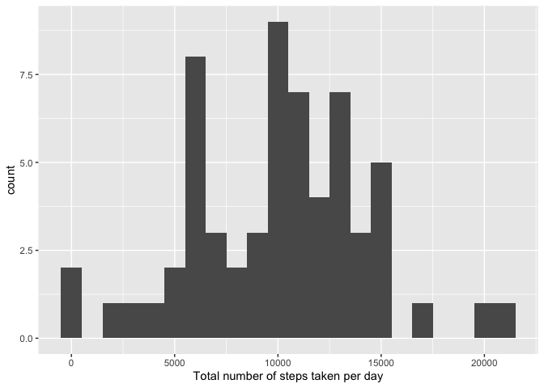
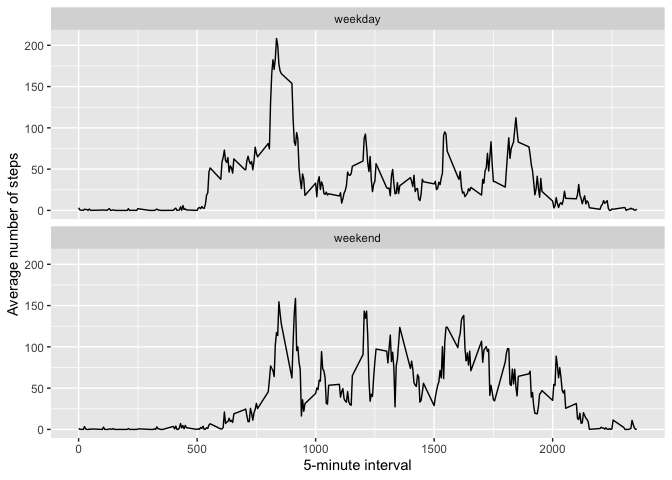

Load R packages:

```r
library(tidyverse)
```

```
## ── Attaching packages ────────────────────────────────────────────── tidyverse 1.3.0 ──
```

```
## ✓ ggplot2 3.2.1     ✓ purrr   0.3.3
## ✓ tibble  2.1.3     ✓ dplyr   0.8.4
## ✓ tidyr   1.0.2     ✓ stringr 1.4.0
## ✓ readr   1.3.1     ✓ forcats 0.4.0
```

```
## ── Conflicts ───────────────────────────────────────────────── tidyverse_conflicts() ──
## x dplyr::filter() masks stats::filter()
## x dplyr::lag()    masks stats::lag()
```

```r
library(lubridate)
```

```
## 
## Attaching package: 'lubridate'
```

```
## The following object is masked from 'package:base':
## 
##     date
```

```r
library(xtable)
library(impute)
```

## Loading and preprocessing the data

### 1. Load the data (i.e. read.csv())).
Unzip and load the file.  

```r
if(!file.exists("activity.csv")) {
  unzip("activity.zip") }
data <- read.csv("activity.csv")
```

### 2. Process/transform the data (if necessary) into a format suitable for your analysis.  


```r
data$steps <- as.numeric(data$steps)
```

## What is mean total number of steps taken per day?  

For this part of the assignment, ignore the missing values in the dataset.

```r
dataComplete <- drop_na(data)
```

### 1. Calculate the total number of steps taken per day.  

```r
stepsTotalByDay <- group_by(dataComplete, date) %>%
        summarize(stepsTotal = sum(steps, na.rm = TRUE))
print(xtable(stepsTotalByDay), type = "html", include.rownames = FALSE)
```

<!-- html table generated in R 3.6.2 by xtable 1.8-4 package -->
<!-- Tue Mar 17 18:02:35 2020 -->
<table border=1>
<tr> <th> date </th> <th> stepsTotal </th>  </tr>
  <tr> <td> 2012-10-02 </td> <td align="right"> 126.00 </td> </tr>
  <tr> <td> 2012-10-03 </td> <td align="right"> 11352.00 </td> </tr>
  <tr> <td> 2012-10-04 </td> <td align="right"> 12116.00 </td> </tr>
  <tr> <td> 2012-10-05 </td> <td align="right"> 13294.00 </td> </tr>
  <tr> <td> 2012-10-06 </td> <td align="right"> 15420.00 </td> </tr>
  <tr> <td> 2012-10-07 </td> <td align="right"> 11015.00 </td> </tr>
  <tr> <td> 2012-10-09 </td> <td align="right"> 12811.00 </td> </tr>
  <tr> <td> 2012-10-10 </td> <td align="right"> 9900.00 </td> </tr>
  <tr> <td> 2012-10-11 </td> <td align="right"> 10304.00 </td> </tr>
  <tr> <td> 2012-10-12 </td> <td align="right"> 17382.00 </td> </tr>
  <tr> <td> 2012-10-13 </td> <td align="right"> 12426.00 </td> </tr>
  <tr> <td> 2012-10-14 </td> <td align="right"> 15098.00 </td> </tr>
  <tr> <td> 2012-10-15 </td> <td align="right"> 10139.00 </td> </tr>
  <tr> <td> 2012-10-16 </td> <td align="right"> 15084.00 </td> </tr>
  <tr> <td> 2012-10-17 </td> <td align="right"> 13452.00 </td> </tr>
  <tr> <td> 2012-10-18 </td> <td align="right"> 10056.00 </td> </tr>
  <tr> <td> 2012-10-19 </td> <td align="right"> 11829.00 </td> </tr>
  <tr> <td> 2012-10-20 </td> <td align="right"> 10395.00 </td> </tr>
  <tr> <td> 2012-10-21 </td> <td align="right"> 8821.00 </td> </tr>
  <tr> <td> 2012-10-22 </td> <td align="right"> 13460.00 </td> </tr>
  <tr> <td> 2012-10-23 </td> <td align="right"> 8918.00 </td> </tr>
  <tr> <td> 2012-10-24 </td> <td align="right"> 8355.00 </td> </tr>
  <tr> <td> 2012-10-25 </td> <td align="right"> 2492.00 </td> </tr>
  <tr> <td> 2012-10-26 </td> <td align="right"> 6778.00 </td> </tr>
  <tr> <td> 2012-10-27 </td> <td align="right"> 10119.00 </td> </tr>
  <tr> <td> 2012-10-28 </td> <td align="right"> 11458.00 </td> </tr>
  <tr> <td> 2012-10-29 </td> <td align="right"> 5018.00 </td> </tr>
  <tr> <td> 2012-10-30 </td> <td align="right"> 9819.00 </td> </tr>
  <tr> <td> 2012-10-31 </td> <td align="right"> 15414.00 </td> </tr>
  <tr> <td> 2012-11-02 </td> <td align="right"> 10600.00 </td> </tr>
  <tr> <td> 2012-11-03 </td> <td align="right"> 10571.00 </td> </tr>
  <tr> <td> 2012-11-05 </td> <td align="right"> 10439.00 </td> </tr>
  <tr> <td> 2012-11-06 </td> <td align="right"> 8334.00 </td> </tr>
  <tr> <td> 2012-11-07 </td> <td align="right"> 12883.00 </td> </tr>
  <tr> <td> 2012-11-08 </td> <td align="right"> 3219.00 </td> </tr>
  <tr> <td> 2012-11-11 </td> <td align="right"> 12608.00 </td> </tr>
  <tr> <td> 2012-11-12 </td> <td align="right"> 10765.00 </td> </tr>
  <tr> <td> 2012-11-13 </td> <td align="right"> 7336.00 </td> </tr>
  <tr> <td> 2012-11-15 </td> <td align="right"> 41.00 </td> </tr>
  <tr> <td> 2012-11-16 </td> <td align="right"> 5441.00 </td> </tr>
  <tr> <td> 2012-11-17 </td> <td align="right"> 14339.00 </td> </tr>
  <tr> <td> 2012-11-18 </td> <td align="right"> 15110.00 </td> </tr>
  <tr> <td> 2012-11-19 </td> <td align="right"> 8841.00 </td> </tr>
  <tr> <td> 2012-11-20 </td> <td align="right"> 4472.00 </td> </tr>
  <tr> <td> 2012-11-21 </td> <td align="right"> 12787.00 </td> </tr>
  <tr> <td> 2012-11-22 </td> <td align="right"> 20427.00 </td> </tr>
  <tr> <td> 2012-11-23 </td> <td align="right"> 21194.00 </td> </tr>
  <tr> <td> 2012-11-24 </td> <td align="right"> 14478.00 </td> </tr>
  <tr> <td> 2012-11-25 </td> <td align="right"> 11834.00 </td> </tr>
  <tr> <td> 2012-11-26 </td> <td align="right"> 11162.00 </td> </tr>
  <tr> <td> 2012-11-27 </td> <td align="right"> 13646.00 </td> </tr>
  <tr> <td> 2012-11-28 </td> <td align="right"> 10183.00 </td> </tr>
  <tr> <td> 2012-11-29 </td> <td align="right"> 7047.00 </td> </tr>
   </table>
  
  
### 2. Make a histogram of the total number of steps taken each day.  

```r
ggplot(data = stepsTotalByDay, aes(stepsTotal)) +
        geom_histogram(binwidth = 1000) +
        labs(x = "Total number of steps taken per day")
```

<!-- -->

### 3. Calculate and report the mean and median of the total number of steps taken per day.    

```r
stepsTotalByDayMean <- mean(stepsTotalByDay$stepsTotal)
stepsTotalByDayMedian <- median(stepsTotalByDay$stepsTotal)
```

The mean of the total number of steps taken per day is 10766 steps.
The median of the total number of steps taken per day is 10765 steps.

## What is the average daily activity pattern?

### 1. Make a time series plot (i.e. type="l") of the 5-minute interval (x-axis) and the average number of steps taken, averaged across all days (y-axis).  

Time series plot of average number of steps taken in 5-minute intervals, averaged across all days


```r
stepsAverageByInterval <- group_by(data, interval) %>%
        summarize(stepsAverage = mean(steps, na.rm = TRUE))

ggplot(data = stepsAverageByInterval, aes(x = interval, y = stepsAverage)) +
        geom_line() +
        labs(x = "5-minute interval",
             y = "Average number of steps")
```

<!-- -->

### 2. Which 5-minute interval, on average across all the days in the dataset, contains the maximum number of steps?


```r
maxInterval <- filter(stepsAverageByInterval, stepsAverage == max(stepsAverage))
maxIntervalNumber <- maxInterval[[1]]
maxIntervalSteps <- round(maxInterval[[2]], 0)
```

The 5-minute interval with maximum average number of steps is interval 835, which has an average of 206 steps.  

## Imputing missing values

### 1. Calculate and report the total number of missing values in the dataset (i.e. the total number of rows with NAs)  

```r
missingValues <- sum(is.na(data$steps))
totalValues <- nrow(data)
```

The total number of missing values in the data set is 2304 out of 
17568 total values.  

### 2. Devise a strategy for filling in all of the missing values in the dataset. The strategy does not need to be sophisticated. For example, you could use the mean/median for that day, or the mean for that 5-minute interval, etc.  

Impute missing data using impute.knn function in impute package, and create a 
new dataset (dataImputed) with missing values imputed.

```r
dataMatrix <- as.matrix(data[ ,c(1,3)])
dataImputedTmp <- impute.knn(dataMatrix, rng.seed = 1)
```

```
## Cluster size 17568 broken into 8784 8784 
## Cluster size 8784 broken into 4401 4383 
## Cluster size 4401 broken into 2126 2275 
## Cluster size 2126 broken into 928 1198 
## Done cluster 928 
## Done cluster 1198 
## Done cluster 2126 
## Cluster size 2275 broken into 2007 268 
## Cluster size 2007 broken into 1132 875 
## Done cluster 1132 
## Done cluster 875 
## Done cluster 2007 
## Done cluster 268 
## Done cluster 2275 
## Done cluster 4401 
## Cluster size 4383 broken into 2196 2187 
## Cluster size 2196 broken into 1220 976 
## Done cluster 1220 
## Done cluster 976 
## Done cluster 2196 
## Cluster size 2187 broken into 976 1211 
## Done cluster 976 
## Done cluster 1211 
## Done cluster 2187 
## Done cluster 4383 
## Done cluster 8784 
## Cluster size 8784 broken into 4392 4392 
## Cluster size 4392 broken into 2195 2197 
## Cluster size 2195 broken into 1215 980 
## Done cluster 1215 
## Done cluster 980 
## Done cluster 2195 
## Cluster size 2197 broken into 1331 866 
## Done cluster 1331 
## Done cluster 866 
## Done cluster 2197 
## Done cluster 4392 
## Cluster size 4392 broken into 2196 2196 
## Cluster size 2196 broken into 1343 853 
## Done cluster 1343 
## Done cluster 853 
## Done cluster 2196 
## Cluster size 2196 broken into 973 1223 
## Done cluster 973 
## Done cluster 1223 
## Done cluster 2196 
## Done cluster 4392 
## Done cluster 8784
```

### 3. Create a new dataset that is equal to the original dataset but with the missing data filled in.  

```r
dataImputed <- as.data.frame(dataImputedTmp$data)
dataImputed <- mutate(dataImputed, date = data$date)
```

### 4. Make a histogram of the total number of steps taken each day. Calculate and report the mean and median total number of steps taken per day. Do these values differ from the estimates from the first part of the assignment? What is the impact of imputing missing data on the estimates of the total daily number of steps?  

Make a histogram of the total number of steps taken each day.

```r
stepsTotalByDayImputed <- group_by(dataImputed, date) %>%
        summarize(stepsTotal = sum(steps, na.rm = TRUE))
ggplot(data = stepsTotalByDayImputed, aes(stepsTotal)) +
        geom_histogram(binwidth = 1000) +
        labs(x = "Total number of steps taken per day")
```

<!-- -->

Calculate and report the mean and median total number of steps taken per day.

```r
stepsTotalByDayImputedMean <- mean(stepsTotalByDayImputed$stepsTotal)
stepsTotalByDayImputedMedian <- median(stepsTotalByDayImputed$stepsTotal)
```

In the dataset including the imputed data, the mean of the total number of steps taken per day is 10195 steps.
In the dataset including the imputed data, the median of the total number of steps taken per day is 10395 steps.

Do these values differ from the estimates from the first part of the assignment? What is the impact of imputing missing data on the estimates of the total daily number of steps?

```r
stepsMeanDiff = stepsTotalByDayImputedMean - stepsTotalByDayMean
stepsMedianDiff = stepsTotalByDayImputedMedian - stepsTotalByDayMedian
```
The mean of the total number of steps taken per day is 10766 and 10195 from the original dataset and dataset with imputed values, respectively. This is a difference of -572.  

The median of the total number of steps taken per day is 10765 and 10395 from the original dataset and dataset with imputed values, respectively. This is a difference of -370.  

## Are there differences in activity patterns between weekdays and weekends?

### 1. Create a new factor variable in the dataset with two levels – “weekday” and “weekend” indicating whether a given date is a weekday or weekend day.

```r
dataImputed <- dataImputed %>%
        mutate(day = wday(ymd(dataImputed$date), label = TRUE, abbr = FALSE)) %>%
        mutate(weekend = ifelse(day == "Saturday" | day == "Sunday", 
                                "weekend", "weekday"))
```

### 2. Make a panel plot containing a time series plot (i.e. type="l") of the 5-minute interval (x-axis) and the average number of steps taken, averaged across all weekday days or weekend days (y-axis).

```r
stepsAverageByIntervalImputed <- group_by(dataImputed, weekend, interval) %>%
        summarize(stepsAverage = mean(steps, na.rm = TRUE))

ggplot(data = stepsAverageByIntervalImputed, 
       aes(x = interval, y = stepsAverage)) +
        geom_line() +
        facet_wrap(vars(weekend), nrow = 2) + 
        labs(x = "5-minute interval",
             y = "Average number of steps")
```

<!-- -->

